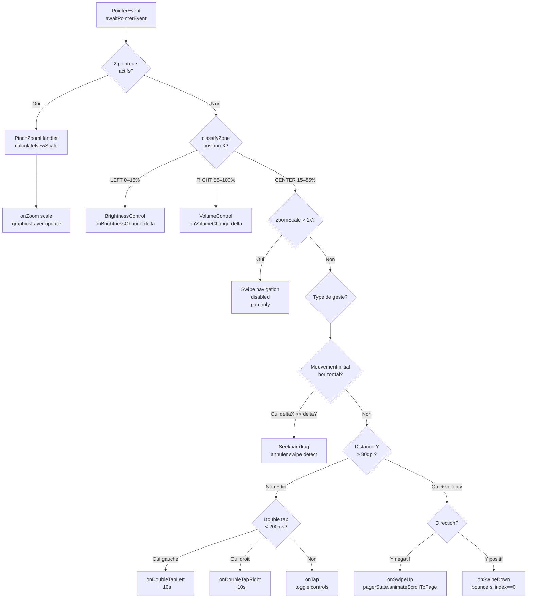
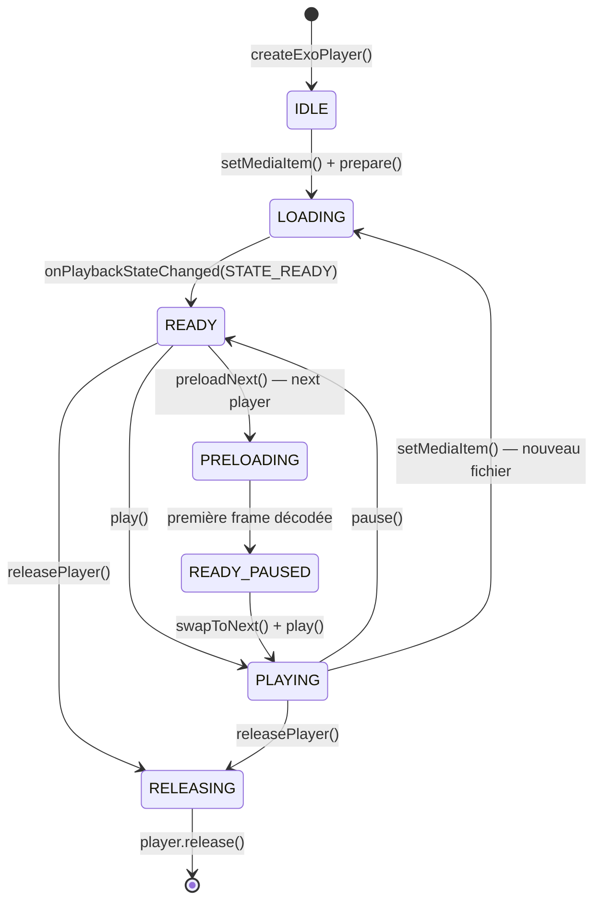
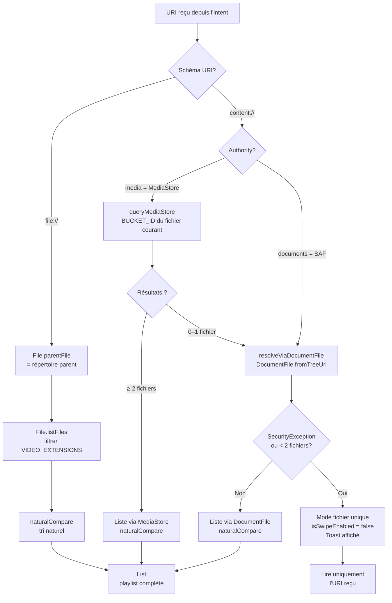
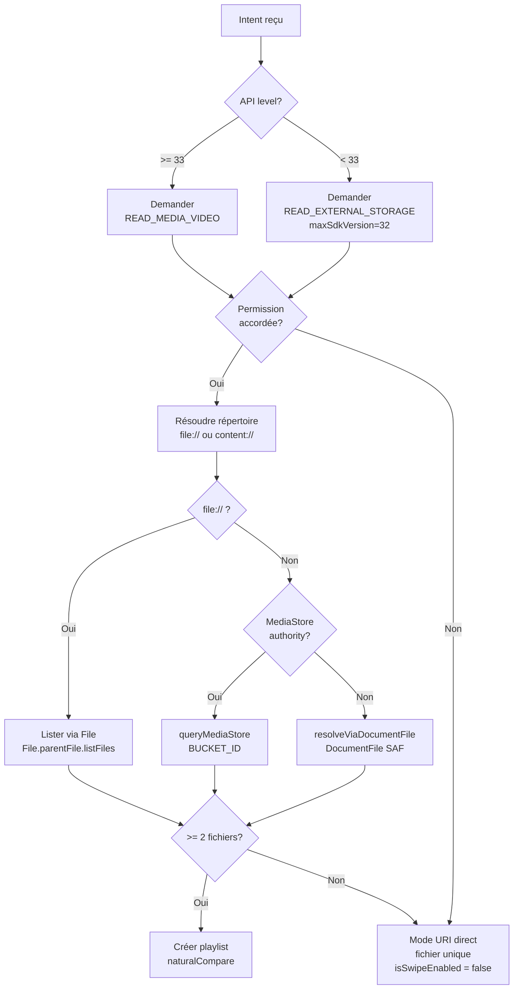

# SwipePlayer — Document de Conception Technique

Ce document est la **référence d'implémentation** : il traduit les specs fonctionnelles (`swipeplayer-specs.md`) et les décisions d'architecture (`CLAUDE.md`) en interfaces Kotlin précises, flux de données, et diagrammes d'états. Il sert de pont direct entre la spec et le code.

---

## Section 1 — Diagramme de flux de données

```mermaid
flowchart TD
    subgraph "Flux 1 : Intent → Lecture"
        I[Intent ACTION_VIEW\nvideo/*] --> PA[PlayerActivity\nonNewIntent / onCreate]
        PA --> VR[VideoRepository\nresolveDirectory]
        VR --> FS{URI type?}
        FS -->|file://| FILE[File.parentFile\nliste + tri naturel]
        FS -->|content://| MS[MediaStore /\nDocumentFile SAF]
        FILE --> PL[playlistVideos: List<VideoFile>]
        MS --> PL
        PL --> PH[PlaybackHistory\ninit avec vidéo courante]
        PH --> VM[PlayerViewModel\n_uiState StateFlow]
        VM --> UI[PlayerScreen\nVerticalPager]
    end

    subgraph "Flux 2 : Geste → Lecture"
        T[Touch Event\npointerInput] --> GH[GestureHandler\nclassifyZone + route]
        GH -->|zone LEFT| BC[BrightnessControl]
        GH -->|zone RIGHT| VC[VolumeControl]
        GH -->|zone CENTER pinch| PZ[PinchZoomHandler\ngraphicsLayer scale]
        GH -->|zone CENTER swipe| SD[SwipeDetector\n≥80dp + velocity]
        GH -->|zone CENTER tap| CT[toggle controls]
        GH -->|zone CENTER double-tap| SK[±10s seek]
        SD --> VM2[PlayerViewModel\nonSwipeUp / onSwipeDown]
        VM2 --> VPM[VideoPlayerManager\nswap players]
        VPM --> EXO[ExoPlayer A/B\nplay / prepare]
        EXO --> SV[SurfaceView\nAndroidView]
    end

    subgraph "Flux 3 : Audio Focus → Lecture"
        AF[AudioFocusManager\nonAudioFocusChange] -->|LOSS| P1[pause]
        AF -->|LOSS_TRANSIENT| P2[pause\nflag résume=true]
        AF -->|GAIN| P3[resume si flag\nvolume 100%]
        AF -->|CAN_DUCK| P4[volume 30%]
        AF -->|NOISY| P5[pause\ndébranchement]
        P1 & P2 & P3 & P4 & P5 --> VM3[PlayerViewModel\nupdatePlayback]
    end
```



---

## Section 2 — Interfaces et classes Kotlin

### `SwipePlayerApp`

```kotlin
/**
 * Application class. Point d'entrée Hilt.
 * Aucune logique métier — initialisation DI uniquement.
 */
@HiltAndroidApp
class SwipePlayerApp : Application()
```

---

### `di/AppModule`

```kotlin
/**
 * Module Hilt singleton. Fournit les dépendances à portée ApplicationComponent.
 */
@Module
@InstallIn(SingletonComponent::class)
object AppModule {

    @Provides @Singleton
    fun provideContext(@ApplicationContext ctx: Context): Context = ctx

    @Provides @Singleton
    fun provideAudioManager(@ApplicationContext ctx: Context): AudioManager =
        ctx.getSystemService(AudioManager::class.java)

    @Provides @Singleton
    fun provideContentResolver(@ApplicationContext ctx: Context): ContentResolver =
        ctx.contentResolver

    @Provides @Singleton
    fun provideVideoRepository(
        @ApplicationContext ctx: Context,
        contentResolver: ContentResolver
    ): VideoRepository = VideoRepository(ctx, contentResolver)

    @Provides @Singleton
    fun providePlaybackHistory(): PlaybackHistory = PlaybackHistory()

    @Provides @Singleton
    fun provideAudioFocusManager(audioManager: AudioManager): AudioFocusManager =
        AudioFocusManager(audioManager)
}
```

---

### `data/VideoFile`

```kotlin
/**
 * Représente un fichier vidéo dans la playlist.
 * Immutable data class — parcelable pour passage inter-composants.
 */
data class VideoFile(
    val uri: Uri,           // URI canonique (content:// ou file://)
    val name: String,       // Nom de fichier avec extension
    val path: String,       // Chemin absolu (vide si content:// pur)
    val duration: Long,     // Durée en ms (-1 si inconnue)
    val size: Long = 0L     // Taille en octets
)

// Extensions supportées (liste exhaustive)
val VIDEO_EXTENSIONS = setOf(
    "mp4", "mkv", "avi", "mov", "wmv", "flv",
    "webm", "m4v", "3gp", "ts", "mpg", "mpeg"
)
```

---

### `data/VideoRepository`

```kotlin
/**
 * Responsable du listing et de l'accès aux fichiers vidéo.
 * Injecté via Hilt (Singleton).
 */
@Singleton
class VideoRepository @Inject constructor(
    @ApplicationContext private val context: Context,
    private val contentResolver: ContentResolver
) {
    /**
     * Liste toutes les vidéos dans le même répertoire que [uri].
     * Retourne une liste d'un seul élément si le répertoire est inaccessible.
     */
    suspend fun listVideosInDirectory(uri: Uri): List<VideoFile>

    /**
     * Résout l'URI en VideoFile (durée via MediaMetadataRetriever si besoin).
     */
    suspend fun resolveVideoFile(uri: Uri): VideoFile?

    // Implémentation interne
    private fun isFileUri(uri: Uri): Boolean
    private fun isMediaStoreUri(uri: Uri): Boolean  // authority == "media"
    private fun isSafUri(uri: Uri): Boolean         // authority contient "documents"

    private suspend fun listViaFile(file: File): List<VideoFile>
    private suspend fun listViaMediaStore(uri: Uri): List<VideoFile>
    private suspend fun resolveViaDocumentFile(uri: Uri): List<VideoFile>

    /**
     * Tri naturel insensible à la casse, numérique-aware.
     * "video2.mp4" < "video10.mp4"
     */
    fun naturalCompare(a: VideoFile, b: VideoFile): Int
}
```

---

### `data/PlaybackHistory`

```kotlin
/**
 * Gère la pile de navigation (historique + pool de vidéos non vues).
 * Non injecté directement — possédé par PlayerViewModel.
 */
class PlaybackHistory {
    // État interne
    private val history: MutableList<VideoFile> = mutableListOf()
    private var currentIndex: Int = 0
    private var peekNextVideo: VideoFile? = null

    val current: VideoFile? get() = history.getOrNull(currentIndex)
    val canGoBack: Boolean get() = currentIndex > 0
    val canGoForward: Boolean get() = currentIndex < history.lastIndex

    /**
     * Initialise avec la vidéo de départ et la playlist complète.
     */
    fun init(startVideo: VideoFile, playlist: List<VideoFile>)

    /**
     * Avance dans l'historique ou ajoute une nouvelle vidéo aléatoire.
     * Retourne la vidéo qui sera lue.
     */
    fun navigateForward(): VideoFile

    /**
     * Recule dans l'historique. Retourne null si déjà au début.
     */
    fun navigateBack(): VideoFile?

    /**
     * Pré-sélectionne la prochaine vidéo aléatoire SANS avancer currentIndex.
     * Appelé dès que la vidéo courante commence à jouer.
     */
    fun peekNext(playlist: List<VideoFile>): VideoFile

    /**
     * Confirme le peekNext comme prochain (lors d'un swipe réel).
     * Évite un double-random si peekNext est déjà calculé.
     */
    fun commitPeek()
}
```

---

### `player/PlayerConfig`

```kotlin
/**
 * Configuration centralisée ExoPlayer. Valeurs immuables.
 */
object PlayerConfig {
    // Buffer
    const val MIN_BUFFER_MS = 5_000
    const val MAX_BUFFER_MS = 30_000
    const val BUFFER_FOR_PLAYBACK_MS = 1_000
    const val BUFFER_FOR_PLAYBACK_AFTER_REBUFFER_MS = 2_000

    // HW+ : pas de fallback logiciel, pas d'extensions
    val renderersFactory: (Context) -> DefaultRenderersFactory = { ctx ->
        DefaultRenderersFactory(ctx)
            .setEnableDecoderFallback(false)
            .setExtensionRendererMode(DefaultRenderersFactory.EXTENSION_RENDERER_MODE_OFF)
    }

    val loadControl: DefaultLoadControl = DefaultLoadControl.Builder()
        .setBufferDurations(
            MIN_BUFFER_MS,
            MAX_BUFFER_MS,
            BUFFER_FOR_PLAYBACK_MS,
            BUFFER_FOR_PLAYBACK_AFTER_REBUFFER_MS
        )
        .build()

    // Zoom
    const val MAX_ZOOM_SCALE = 4f
    const val MIN_ZOOM_SCALE = 1f

    // Gestes
    const val SWIPE_MIN_DP = 80f
    const val LEFT_ZONE_FRACTION = 0.15f
    const val RIGHT_ZONE_FRACTION = 0.85f

    // Auto-hide contrôles
    const val CONTROLS_HIDE_DELAY_MS = 4_000L

    // Codec failure auto-skip
    const val CODEC_FAILURE_SKIP_DELAY_MS = 2_000L
}
```

---

### `player/AudioFocusManager`

```kotlin
/**
 * Gère l'audio focus Android et les événements NOISY (débranchement écouteurs).
 * Communique via callbacks vers le ViewModel.
 */
@Singleton
class AudioFocusManager @Inject constructor(
    private val audioManager: AudioManager
) {
    interface Listener {
        fun onPause()
        fun onResume()
        fun onDuck()      // Réduire volume à 30%
        fun onUnduck()    // Restaurer volume à 100%
    }

    var listener: Listener? = null

    /**
     * Demande l'audio focus. Appeler au début de la lecture.
     * @return true si le focus est obtenu immédiatement.
     */
    fun requestFocus(): Boolean

    /**
     * Libère l'audio focus. Appeler à onDestroy ou pause définitive.
     */
    fun abandonFocus()

    /**
     * Enregistre le BroadcastReceiver NOISY. Appeler dans onStart.
     */
    fun registerNoisyReceiver(context: Context)

    /**
     * Désenregistre le BroadcastReceiver. Appeler dans onStop.
     */
    fun unregisterNoisyReceiver(context: Context)

    // Implémentation interne
    private val focusRequest: AudioFocusRequest by lazy { buildFocusRequest() }
    private val noisyReceiver: BroadcastReceiver = buildNoisyReceiver()
    private fun buildFocusRequest(): AudioFocusRequest
    private fun buildNoisyReceiver(): BroadcastReceiver
}
```

---

### `player/VideoPlayerManager`

```kotlin
/**
 * Crée et gère les instances ExoPlayer (max 2 simultanées).
 * Gère le swap current/next lors des swipes.
 * Injecté via Hilt (Singleton).
 */
@Singleton
class VideoPlayerManager @Inject constructor(
    @ApplicationContext private val context: Context
) {
    // Les deux slots de players
    var currentPlayer: ExoPlayer? = null
        private set
    var nextPlayer: ExoPlayer? = null
        private set

    /**
     * Crée un ExoPlayer avec la config HW+ et charge [video] dedans.
     * Si [preloadOnly] = true, prépare et décode la première frame mais ne lance pas la lecture.
     */
    suspend fun preparePlayer(video: VideoFile, preloadOnly: Boolean = false): ExoPlayer

    /**
     * Fait le swap : next → current, libère l'ancien current.
     * Attache le player à [surfaceView] avant la lecture.
     */
    fun swapToNext(surfaceView: SurfaceView)

    /**
     * Prépare le next player pour [video] (preloadOnly = true).
     * Appelé par peekNext dès que la vidéo courante commence.
     */
    suspend fun preloadNext(video: VideoFile)

    /**
     * Séquence de libération ordonnée et safe.
     * Doit tourner sur Dispatchers.IO.
     */
    suspend fun releasePlayer(player: ExoPlayer, surfaceView: SurfaceView?)

    /**
     * Libère tous les players. Appeler dans onDestroy.
     */
    suspend fun releaseAll()

    // Attache/détache la surface proprement
    fun attachSurface(player: ExoPlayer, surfaceView: SurfaceView)
    fun detachSurface(player: ExoPlayer, surfaceView: SurfaceView)

    // Création interne
    private fun createExoPlayer(): ExoPlayer
}
```

---

### `ui/PlayerActivity`

```kotlin
/**
 * Activity unique. Reçoit l'intent VIEW, initialise le ViewModel,
 * délègue tout le rendu à PlayerScreen.
 * configChanges évite la recréation en rotation.
 */
@AndroidEntryPoint
class PlayerActivity : ComponentActivity() {

    @Inject lateinit var audioFocusManager: AudioFocusManager
    private val viewModel: PlayerViewModel by viewModels()

    override fun onCreate(savedInstanceState: Bundle?)
    override fun onNewIntent(intent: Intent)   // singleTask : gérer un second "Ouvrir avec"
    override fun onStart()
    override fun onStop()
    override fun onDestroy()

    // Applique l'immersive sticky mode
    private fun enableFullscreen()

    // Extrait et transmet l'URI de l'intent au ViewModel
    private fun handleIntent(intent: Intent)
}
```

---

### `ui/PlayerViewModel`

```kotlin
/**
 * ViewModel principal. Source de vérité unique via _uiState.
 * Orchestre PlaybackHistory, VideoRepository, VideoPlayerManager, AudioFocusManager.
 */
@HiltViewModel
class PlayerViewModel @Inject constructor(
    private val videoRepository: VideoRepository,
    private val playerManager: VideoPlayerManager,
    private val audioFocusManager: AudioFocusManager
) : ViewModel(), AudioFocusManager.Listener {

    private val _uiState = MutableStateFlow(PlayerUiState())
    val uiState: StateFlow<PlayerUiState> = _uiState.asStateFlow()

    private val history = PlaybackHistory()

    // Appelé par PlayerActivity avec l'URI reçu
    fun onIntentReceived(uri: Uri)

    // Navigation
    fun onSwipeUp()
    fun onSwipeDown()

    // Playback
    fun onPlayPause()
    fun onSeek(positionMs: Long)
    fun onSeekRelative(deltaMs: Long)   // ±10s
    fun onSpeedChange(speed: Float)

    // UI
    fun onToggleControls()
    fun onZoomChange(scale: Float)
    fun onDisplayModeChange()           // cycle Adapt→Fill→Stretch→100%
    fun onOrientationChange()           // cycle Auto→Landscape→Portrait

    // AudioFocusManager.Listener
    override fun onPause()
    override fun onResume()
    override fun onDuck()
    override fun onUnduck()

    // Lifecycle hooks (appelés par PlayerActivity)
    fun onActivityStart()
    fun onActivityStop()
    fun onActivityDestroy()

    // Interne : peekNext déclenché dès que isPlaying passe à true
    private fun triggerPeekNext()
    private fun loadPlaylist(uri: Uri)
}
```

---

### `ui/PlayerUiState`

```kotlin
/**
 * État UI complet, immutable. Émis via StateFlow.
 */
data class PlayerUiState(
    // Playlist
    val playlist: List<VideoFile> = emptyList(),
    val currentVideo: VideoFile? = null,
    val previousVideo: VideoFile? = null,   // pour la page 0 du VerticalPager
    val isSwipeEnabled: Boolean = true,      // false si 1 seule vidéo ou content:// sans accès

    // Playback
    val isPlaying: Boolean = false,
    val playbackSpeed: Float = 1f,
    val positionMs: Long = 0L,
    val durationMs: Long = 0L,
    val bufferedPositionMs: Long = 0L,

    // UI Controls
    val controlsVisible: Boolean = true,
    val zoomScale: Float = 1f,

    // Display
    val displayMode: DisplayMode = DisplayMode.ADAPT,
    val orientationMode: OrientationMode = OrientationMode.AUTO,

    // Brightness & Volume (0f..1f)
    val brightness: Float = -1f,            // -1 = valeur système
    val volume: Float = 1f,

    // Erreurs
    val error: PlayerError? = null,

    // Loading
    val isLoading: Boolean = false
)

enum class DisplayMode { ADAPT, FILL, STRETCH, NATIVE_100 }
enum class OrientationMode { AUTO, LANDSCAPE, PORTRAIT }

sealed class PlayerError {
    object CodecNotSupported : PlayerError()
    object FileNotFound : PlayerError()
    object ContentUriNoAccess : PlayerError()
    data class Generic(val message: String) : PlayerError()
}
```

---

### `ui/screen/PlayerScreen`

```kotlin
/**
 * Composable racine. Contient le VerticalPager et orchestre les overlays.
 * userScrollEnabled = false — le scroll est entièrement contrôlé par GestureHandler.
 */
@Composable
fun PlayerScreen(
    viewModel: PlayerViewModel,
    modifier: Modifier = Modifier
) {
    val uiState by viewModel.uiState.collectAsStateWithLifecycle()
    val pagerState = rememberPagerState(initialPage = 1, pageCount = { 2 })
    val coroutineScope = rememberCoroutineScope()

    // Reset silencieux après chaque swipe complété
    LaunchedEffect(pagerState.currentPage) {
        if (pagerState.currentPage != 1) {
            val swipedUp = pagerState.currentPage == 0  // Dans un pager 2-pages inversé
            if (swipedUp) viewModel.onSwipeUp() else viewModel.onSwipeDown()
            pagerState.scrollToPage(1)  // Sans animation
        }
    }

    Box(modifier = modifier.fillMaxSize()) {
        VerticalPager(
            state = pagerState,
            userScrollEnabled = false,   // Géré manuellement
            beyondBoundsPageCount = 1,
            modifier = Modifier.fillMaxSize()
        ) { page ->
            val video = if (page == 1) uiState.currentVideo else uiState.previousVideo
            VideoPlayerPage(video = video, isActive = page == 1)
        }

        // Overlay gestures + contrôles, par-dessus le pager
        GestureHandler(
            uiState = uiState,
            pagerState = pagerState,
            onSwipeUp = { coroutineScope.launch { pagerState.animateScrollToPage(0) } },
            onSwipeDown = { /* bounce si currentIndex == 0, sinon animateScrollToPage(2) */ },
            onTap = viewModel::onToggleControls,
            onDoubleTapLeft = { viewModel.onSeekRelative(-10_000L) },
            onDoubleTapRight = { viewModel.onSeekRelative(10_000L) },
            onZoom = viewModel::onZoomChange,
            onBrightness = { /* update uiState.brightness */ },
            onVolume = { /* AudioManager */ }
        )

        AnimatedVisibility(
            visible = uiState.controlsVisible,
            enter = fadeIn(tween(200, easing = FastOutSlowInEasing)),
            exit = fadeOut(tween(200, easing = FastOutSlowInEasing))
        ) {
            ControlsOverlay(uiState = uiState, viewModel = viewModel)
        }
    }
}
```

---

### `ui/components/VideoSurface`

```kotlin
/**
 * Rendu vidéo via SurfaceView wrappé dans AndroidView.
 * graphicsLayer applique le zoom sans affecter les contrôles.
 */
@Composable
fun VideoSurface(
    player: ExoPlayer?,
    zoomScale: Float,
    modifier: Modifier = Modifier
) {
    AndroidView(
        factory = { ctx ->
            SurfaceView(ctx).also { sv ->
                player?.setVideoSurfaceView(sv)
            }
        },
        update = { sv ->
            // Réattacher si le player change
            player?.setVideoSurfaceView(sv)
        },
        modifier = modifier.graphicsLayer {
            scaleX = zoomScale
            scaleY = zoomScale
        }
    )
}
```

---

### `ui/components/ControlsOverlay`

```kotlin
/**
 * Overlay semi-transparent contenant tous les contrôles UI.
 * Auto-hide via LaunchedEffect (4s d'inactivité).
 */
@Composable
fun ControlsOverlay(
    uiState: PlayerUiState,
    viewModel: PlayerViewModel,
    modifier: Modifier = Modifier
) {
    // Auto-hide timer
    LaunchedEffect(uiState.controlsVisible) {
        if (uiState.controlsVisible) {
            delay(PlayerConfig.CONTROLS_HIDE_DELAY_MS)
            viewModel.onToggleControls()
        }
    }

    Box(
        modifier = modifier
            .fillMaxSize()
            .background(Color(0x80000000))  // #80000000
    ) {
        TopBar(title = uiState.currentVideo?.name ?: "", onBack = { /* finish() */ })
        CenterControls(uiState = uiState, viewModel = viewModel)
        Column(modifier = Modifier.align(Alignment.BottomCenter)) {
            ProgressBar(uiState = uiState, viewModel = viewModel)
            ToolBar(uiState = uiState, viewModel = viewModel)
        }
        BrightnessControl(brightness = uiState.brightness)
        VolumeControl(volume = uiState.volume)
    }
}
```

---

### `ui/components/TopBar`

```kotlin
@Composable
fun TopBar(
    title: String,           // Nom du fichier (avec extension), tronqué si nécessaire
    onBack: () -> Unit,      // finish() via PlayerActivity
    modifier: Modifier = Modifier
)
// Police : 16sp, sans-serif, blanc, shadow
// Icône retour : Material Icons ArrowBack
```

---

### `ui/components/CenterControls`

```kotlin
@Composable
fun CenterControls(
    uiState: PlayerUiState,
    viewModel: PlayerViewModel,
    modifier: Modifier = Modifier
)
// Contient : IconButton(replay10) + IconButton(play/pause 48dp) + IconButton(forward10)
// Arrangement horizontal centré
```

---

### `ui/components/ProgressBar`

```kotlin
@Composable
fun ProgressBar(
    uiState: PlayerUiState,
    viewModel: PlayerViewModel,
    modifier: Modifier = Modifier
)
// Timecode gauche (position) | Slider | Timecode droit (durée)
// Couleur remplie : #E50914 (Netflix red)
// Buffer : #80FFFFFF
// Fond : #40FFFFFF
// Timecodes : monospace 14sp, format MM:SS ou HH:MM:SS si durée >= 1h
// onValueChangeFinished → viewModel.onSeek(positionMs)
```

---

### `ui/components/ToolBar`

```kotlin
@Composable
fun ToolBar(
    uiState: PlayerUiState,
    viewModel: PlayerViewModel,
    modifier: Modifier = Modifier
)
// 4 boutons : SpeedSelector | SettingsSheet | DisplayMode | OrientationMode
// Espacés de 32dp, alignés à gauche
```

---

### `ui/components/BrightnessControl`

```kotlin
@Composable
fun BrightnessControl(
    brightness: Float,       // 0f..1f, -1 = caché
    modifier: Modifier = Modifier
)
// Affiché uniquement pendant le geste (brightness >= 0)
// Barre verticale + icône soleil, couleur #FFC107
// Animation update : 100ms Linear
```

---

### `ui/components/VolumeControl`

```kotlin
@Composable
fun VolumeControl(
    volume: Float,           // 0f..1f
    modifier: Modifier = Modifier
)
// Affiché uniquement pendant le geste
// Barre verticale + icône haut-parleur, couleur #2196F3
// Animation update : 100ms Linear
```

---

### `ui/components/DoubleTapFeedback`

```kotlin
@Composable
fun DoubleTapFeedback(
    side: TapSide,           // LEFT (-10s) ou RIGHT (+10s)
    modifier: Modifier = Modifier
)
// Cercles concentriques + texte "-10s" / "+10s"
// Animation : fade in 100ms + fade out 400ms = 500ms total
enum class TapSide { LEFT, RIGHT }
```

---

### `ui/components/SpeedSelector`

```kotlin
@Composable
fun SpeedSelector(
    currentSpeed: Float,
    onSpeedSelected: (Float) -> Unit,
    modifier: Modifier = Modifier
)
// Popup/DropdownMenu avec les vitesses :
// 0.25, 0.5, 0.75, 1.0, 1.25, 1.5, 1.75, 2.0, 3.0, 4.0
// Applique via player.setPlaybackParameters(PlaybackParameters(speed))
```

---

### `ui/components/SettingsSheet`

```kotlin
@Composable
fun SettingsSheet(
    uiState: PlayerUiState,
    viewModel: PlayerViewModel,
    onDismiss: () -> Unit,
    modifier: Modifier = Modifier
)
// ModalBottomSheet avec :
// - Sélection piste audio (liste des tracks disponibles)
// - Sélection sous-titres (pistes intégrées + fichiers .srt/.ass/.ssa)
// - Indicateur décodeur (toujours HW+, read-only)
```

---

### `ui/gesture/GestureHandler`

```kotlin
/**
 * Modifier extension unique qui gère TOUS les gestes.
 * Routage par position X du premier pointer.
 * Un seul pointerInput évite les conflits.
 */
fun Modifier.gestureHandler(
    screenWidthPx: Float,
    zoomScale: Float,
    isSwipeEnabled: Boolean,
    onSwipeUp: () -> Unit,
    onSwipeDown: () -> Unit,
    onTap: () -> Unit,
    onDoubleTapLeft: () -> Unit,
    onDoubleTapRight: () -> Unit,
    onZoom: (scale: Float) -> Unit,
    onBrightnessChange: (delta: Float) -> Unit,
    onVolumeChange: (delta: Float) -> Unit
): Modifier = this.pointerInput(zoomScale, isSwipeEnabled) {
    awaitEachGesture {
        // Voir squelette complet en Section 3
    }
}

/**
 * Classifie la zone en fonction de la position X normalisée.
 */
fun classifyZone(x: Float, screenWidth: Float): GestureZone

enum class GestureZone { LEFT, CENTER, RIGHT }
```

---

### `ui/gesture/SwipeDetector`

```kotlin
/**
 * Détecte un swipe vertical valide (≥80dp, vélocité suffisante,
 * pas d'intention horizontale initiale).
 */
class SwipeDetector(private val minDistancePx: Float, private val minVelocityPx: Float) {

    /**
     * Retourne le résultat du swipe ou null si non déclenché.
     * @param startY position Y du premier pointer down
     * @param events séquence des MotionEvent collectés
     */
    fun detect(startY: Float, currentY: Float, velocityY: Float): SwipeResult?

    /**
     * Retourne true si le mouvement initial est trop horizontal
     * pour être un swipe vidéo (→ c'est la seekbar).
     */
    fun isHorizontalIntent(deltaX: Float, deltaY: Float): Boolean

    enum class SwipeResult { UP, DOWN }
}
```

---

### `ui/gesture/PinchZoomHandler`

```kotlin
/**
 * Détecte et calcule le zoom pinch.
 * Retourne la nouvelle échelle clampée entre 1f et 4f.
 */
class PinchZoomHandler {

    /**
     * Calculé à partir du span entre deux pointeurs.
     * @param previousSpan distance entre les deux doigts au frame précédent
     * @param currentSpan distance actuelle
     * @param currentScale échelle actuelle
     */
    fun calculateNewScale(previousSpan: Float, currentSpan: Float, currentScale: Float): Float =
        (currentScale * (currentSpan / previousSpan)).coerceIn(
            PlayerConfig.MIN_ZOOM_SCALE,
            PlayerConfig.MAX_ZOOM_SCALE
        )
}
```

---

## Section 3 — Flux de gestion des gestes

### Diagramme de décision



### Règle de classification des zones (`classifyZone`)

```kotlin
fun classifyZone(x: Float, screenWidth: Float): GestureZone = when {
    x < screenWidth * PlayerConfig.LEFT_ZONE_FRACTION  -> GestureZone.LEFT
    x > screenWidth * PlayerConfig.RIGHT_ZONE_FRACTION -> GestureZone.RIGHT
    else                                               -> GestureZone.CENTER
}
```

### Squelette `pointerInput` unique

```kotlin
fun Modifier.gestureHandler(/* params */): Modifier =
    this.pointerInput(zoomScale, isSwipeEnabled) {
        val screenWidthPx = size.width.toFloat()
        val minSwipePx = with(density) { PlayerConfig.SWIPE_MIN_DP.dp.toPx() }
        val velocityTracker = VelocityTracker()
        var lastTapTime = 0L
        var firstTapPosition = Offset.Zero

        awaitEachGesture {
            // 1. Attendre le premier pointer down
            val down = awaitFirstDown(requireUnconsumed = false)
            val startPosition = down.position
            val startTime = SystemClock.elapsedRealtime()
            val zone = classifyZone(startPosition.x, screenWidthPx)
            velocityTracker.resetTracking()
            velocityTracker.addPosition(startTime, startPosition)

            var isDragging = false
            var isHorizontalIntent = false
            var pointerCount = 1
            var previousSpan = 0f

            // 2. Boucle de suivi des mouvements
            while (true) {
                val event = awaitPointerEvent()
                pointerCount = event.changes.count { it.pressed }

                // Pinch : 2 pointeurs
                if (pointerCount >= 2) {
                    val c1 = event.changes[0].position
                    val c2 = event.changes[1].position
                    val span = (c1 - c2).getDistance()
                    if (previousSpan == 0f) previousSpan = span
                    val newScale = pinchHandler.calculateNewScale(previousSpan, span, zoomScale)
                    onZoom(newScale)
                    previousSpan = span
                    event.changes.forEach { it.consume() }
                    continue
                }

                val change = event.changes.firstOrNull() ?: break
                if (!change.pressed) break  // Pointer up → fin du geste

                val delta = change.position - down.position
                val currentTime = SystemClock.elapsedRealtime()
                velocityTracker.addPosition(currentTime, change.position)

                // Détecter intention horizontale (seekbar)
                if (!isDragging && !isHorizontalIntent) {
                    isHorizontalIntent = swipeDetector.isHorizontalIntent(delta.x, delta.y)
                }

                when (zone) {
                    GestureZone.LEFT  -> onBrightnessChange(-delta.y / screenHeightPx)
                    GestureZone.RIGHT -> onVolumeChange(-delta.y / screenHeightPx)
                    GestureZone.CENTER -> {
                        if (!isHorizontalIntent && !isDragging) {
                            if (delta.y.absoluteValue > minSwipePx) isDragging = true
                        }
                    }
                }
                change.consume()
            }

            // 3. Pointer UP — classifier le geste final
            val velocity = velocityTracker.calculateVelocity()
            val totalDelta = /* position finale - startPosition */
            val elapsedMs = SystemClock.elapsedRealtime() - startTime

            when (zone) {
                GestureZone.CENTER -> {
                    if (isDragging && !isHorizontalIntent && isSwipeEnabled && zoomScale == 1f) {
                        val result = swipeDetector.detect(
                            startY = startPosition.y,
                            currentY = startPosition.y + totalDelta.y,
                            velocityY = velocity.y
                        )
                        when (result) {
                            SwipeDetector.SwipeResult.UP   -> onSwipeUp()
                            SwipeDetector.SwipeResult.DOWN -> onSwipeDown()
                            null -> Unit
                        }
                    } else if (!isDragging) {
                        // Tap ou double tap
                        val now = SystemClock.elapsedRealtime()
                        if (now - lastTapTime < 200L) {
                            val isLeft = firstTapPosition.x < screenWidthPx / 2
                            if (isLeft) onDoubleTapLeft() else onDoubleTapRight()
                            lastTapTime = 0L
                        } else {
                            lastTapTime = now
                            firstTapPosition = startPosition
                            // Attendre 200ms pour confirmer tap simple
                            // (via coroutine delay dans l'implémentation réelle)
                            onTap()
                        }
                    }
                }
                GestureZone.LEFT, GestureZone.RIGHT -> Unit // Déjà géré en temps réel
            }
        }
    }
```

### Intégration VerticalPager

```kotlin
// Dans PlayerScreen.kt

val pagerState = rememberPagerState(initialPage = 1, pageCount = { 2 })
val scope = rememberCoroutineScope()

// userScrollEnabled = false : le scroll est déclenché programmatiquement par GestureHandler
VerticalPager(
    state = pagerState,
    userScrollEnabled = false,
    beyondBoundsPageCount = 1
) { page -> /* ... */ }

// Reset silencieux après chaque swipe complété
LaunchedEffect(pagerState.currentPage) {
    when (pagerState.currentPage) {
        0 -> {
            viewModel.onSwipeDown()
            pagerState.scrollToPage(1)   // Reset immédiat, sans animation
        }
        2 -> {
            viewModel.onSwipeUp()
            pagerState.scrollToPage(1)
        }
    }
}

// Déclenchement programmatique depuis GestureHandler
val onSwipeUpGesture: () -> Unit = {
    if (uiState.isSwipeEnabled && uiState.zoomScale == 1f) {
        scope.launch { pagerState.animateScrollToPage(2) }
    }
}
val onSwipeDownGesture: () -> Unit = {
    if (uiState.isSwipeEnabled && history.canGoBack) {
        scope.launch { pagerState.animateScrollToPage(0) }
    } else {
        // Bounce visuel : l'élasticité native du pager suffit si userScrollEnabled = true temporairement
    }
}
```

> **Note** : Avec `pageCount = { 2 }`, les pages sont 0 et 1. Pour un reset à 3 pages (0=prev, 1=current, 2=next), utiliser `pageCount = { 3 }` et `initialPage = 1`. Après chaque swipe complété, `scrollToPage(1)` recentre sans animation.

---

## Section 4 — Cycle de vie ExoPlayer pendant les swipes

### Diagramme d'états



### Tableau des états des deux instances

| Moment | Player A (current) | Player B (next) |
|---|---|---|
| **Lancement app** | LOADING → PLAYING (vidéo initiale) | — (non créé) |
| **peekNext déclenché** | PLAYING | LOADING (vidéo N+1) |
| **peekNext prêt** | PLAYING | READY_PAUSED (1ère frame) |
| **Swipe début** | PLAYING (visible, slide up) | READY_PAUSED (slide in depuis bas) |
| **Swipe 50% complété** | PLAYING (toujours actif) | play() déclenché |
| **Swipe confirmé** | detachSurface → RELEASING | PLAYING — devient current |
| **Swipe annulé** | PLAYING (reprend focus) | READY_PAUSED (préservé) |
| **Swipe down (back)** | RELEASING | Ancien Player A (précédent) devient current |
| **App en background** | pause() | READY_PAUSED (inchangé) |
| **App au premier plan** | resume() si était playing | READY_PAUSED (inchangé) |
| **onDestroy** | RELEASING | RELEASING |

### Séquence de libération mémoire (ordonnée)

```kotlin
// Sur Dispatchers.IO obligatoirement
suspend fun releasePlayer(player: ExoPlayer, surfaceView: SurfaceView?) {
    withContext(Dispatchers.IO) {
        // 1. Détacher la surface AVANT release pour éviter les leaks GL
        surfaceView?.let { sv ->
            withContext(Dispatchers.Main) {
                player.clearVideoSurfaceView(sv)
                // Alternative si clearVideoSurfaceView non disponible :
                // player.setVideoSurface(null)
            }
        }

        // 2. Stopper la lecture proprement
        withContext(Dispatchers.Main) {
            player.stop()
        }

        // 3. Libérer les items media (libère les sources)
        withContext(Dispatchers.Main) {
            player.clearMediaItems()
        }

        // 4. Libération finale (synchrone, peut bloquer → IO)
        player.release()
    }
}
```

### Vue temporelle du swap (t=0 à t=300ms)

```
t=0ms    : Swipe UP détecté (≥80dp + velocity)
           pagerState.animateScrollToPage(2) déclenché

t=0–300ms: Animation VerticalPager (300ms, DecelerateInterpolator)
           Player A : visible, en lecture (slide vers le haut)
           Player B : visible, READY_PAUSED (slide depuis le bas)
           → À 50% visible (t≈150ms) : Player B.play() déclenché

t=300ms  : Animation terminée. Page 2 est visible.
           LaunchedEffect(pagerState.currentPage) détecte currentPage==2
           → viewModel.onSwipeUp() : history.commitPeek(), currentIndex++
           → pagerState.scrollToPage(1) : reset silencieux

t=300ms+ : Player A : detachSurface() → stop() → clearMediaItems() → release()
           Player B : désormais currentPlayer
           Nouveau peekNext() : création Player C pour la vidéo N+2
```

---

## Section 5 — Gestion content:// vs file://

### Diagramme de décision URI



### Snippets Kotlin

#### `isMediaStoreUri`

```kotlin
fun Uri.isMediaStoreUri(): Boolean =
    authority?.equals("media", ignoreCase = true) == true ||
    authority?.contains("media", ignoreCase = true) == true
```

#### `isSafUri`

```kotlin
fun Uri.isSafUri(): Boolean =
    authority?.contains("documents", ignoreCase = true) == true ||
    authority?.contains("com.android.externalstorage", ignoreCase = true) == true
```

#### `queryMediaStore` (avec BUCKET_ID)

```kotlin
/**
 * Récupère toutes les vidéos dans le même répertoire via MediaStore.
 * Utilise BUCKET_ID pour identifier le répertoire sans accès au système de fichiers.
 */
suspend fun queryMediaStore(uri: Uri, contentResolver: ContentResolver): List<VideoFile> =
    withContext(Dispatchers.IO) {
        val result = mutableListOf<VideoFile>()

        // 1. Récupérer le BUCKET_ID du fichier courant
        val bucketId = contentResolver.query(
            uri,
            arrayOf(MediaStore.Video.Media.BUCKET_ID),
            null, null, null
        )?.use { cursor ->
            if (cursor.moveToFirst())
                cursor.getLong(cursor.getColumnIndexOrThrow(MediaStore.Video.Media.BUCKET_ID))
            else null
        } ?: return@withContext emptyList()

        // 2. Lister toutes les vidéos du même bucket
        val projection = arrayOf(
            MediaStore.Video.Media._ID,
            MediaStore.Video.Media.DISPLAY_NAME,
            MediaStore.Video.Media.DATA,
            MediaStore.Video.Media.DURATION,
            MediaStore.Video.Media.SIZE
        )
        val selection = "${MediaStore.Video.Media.BUCKET_ID} = ?"
        val selectionArgs = arrayOf(bucketId.toString())

        contentResolver.query(
            MediaStore.Video.Media.EXTERNAL_CONTENT_URI,
            projection, selection, selectionArgs, null
        )?.use { cursor ->
            val idCol   = cursor.getColumnIndexOrThrow(MediaStore.Video.Media._ID)
            val nameCol = cursor.getColumnIndexOrThrow(MediaStore.Video.Media.DISPLAY_NAME)
            val dataCol = cursor.getColumnIndexOrThrow(MediaStore.Video.Media.DATA)
            val durCol  = cursor.getColumnIndexOrThrow(MediaStore.Video.Media.DURATION)
            val sizeCol = cursor.getColumnIndexOrThrow(MediaStore.Video.Media.SIZE)

            while (cursor.moveToNext()) {
                val id   = cursor.getLong(idCol)
                val name = cursor.getString(nameCol) ?: continue
                val ext  = name.substringAfterLast('.', "").lowercase()
                if (ext !in VIDEO_EXTENSIONS) continue

                result.add(VideoFile(
                    uri      = ContentUris.withAppendedId(MediaStore.Video.Media.EXTERNAL_CONTENT_URI, id),
                    name     = name,
                    path     = cursor.getString(dataCol) ?: "",
                    duration = cursor.getLong(durCol),
                    size     = cursor.getLong(sizeCol)
                ))
            }
        }
        result
    }
```

#### `resolveViaDocumentFile` (avec catch SecurityException)

```kotlin
/**
 * Tente de lister le répertoire parent via SAF DocumentFile.
 * Retourne une liste vide si l'accès est refusé (SecurityException).
 */
suspend fun resolveViaDocumentFile(uri: Uri, context: Context): List<VideoFile> =
    withContext(Dispatchers.IO) {
        try {
            val singleDoc = DocumentFile.fromSingleUri(context, uri)
                ?: return@withContext emptyList()

            // Tenter d'accéder au parent via SAF (nécessite permission TREE)
            val parentDoc = singleDoc.parentFile
                ?: return@withContext emptyList()

            parentDoc.listFiles()
                .filter { doc ->
                    doc.isFile &&
                    doc.name?.substringAfterLast('.', "")?.lowercase() in VIDEO_EXTENSIONS
                }
                .map { doc ->
                    VideoFile(
                        uri      = doc.uri,
                        name     = doc.name ?: doc.uri.lastPathSegment ?: "",
                        path     = "",
                        duration = -1L,
                        size     = doc.length()
                    )
                }
        } catch (e: SecurityException) {
            // Pas de permission SAF → mode fichier unique
            emptyList()
        } catch (e: Exception) {
            emptyList()
        }
    }
```

### Flux de permissions (Mermaid)



### Implémentation du tri naturel (`naturalCompare`)

```kotlin
/**
 * Tri naturel insensible à la casse, numérique-aware.
 * Tokenise chaque nom en segments alternés texte/numérique.
 *
 * Exemple : "video2.mp4" < "video10.mp4" (2 < 10 numériquement)
 *           "Episode 1" < "Episode 2" < "Episode 10"
 */
private val NATURAL_SORT_REGEX = Regex("(\\d+)|(\\D+)")

fun naturalCompare(a: String, b: String): Int {
    val tokensA = NATURAL_SORT_REGEX.findAll(a.lowercase()).toList()
    val tokensB = NATURAL_SORT_REGEX.findAll(b.lowercase()).toList()

    val size = minOf(tokensA.size, tokensB.size)
    for (i in 0 until size) {
        val ta = tokensA[i].value
        val tb = tokensB[i].value
        val na = ta.toLongOrNull()
        val nb = tb.toLongOrNull()

        val cmp = when {
            na != null && nb != null -> na.compareTo(nb)  // Comparaison numérique
            else                     -> ta.compareTo(tb)  // Comparaison lexicale
        }
        if (cmp != 0) return cmp
    }
    return tokensA.size.compareTo(tokensB.size)
}

// Usage dans VideoRepository :
fun List<VideoFile>.sortedNaturally(): List<VideoFile> =
    sortedWith { a, b -> naturalCompare(a.name, b.name) }
```
